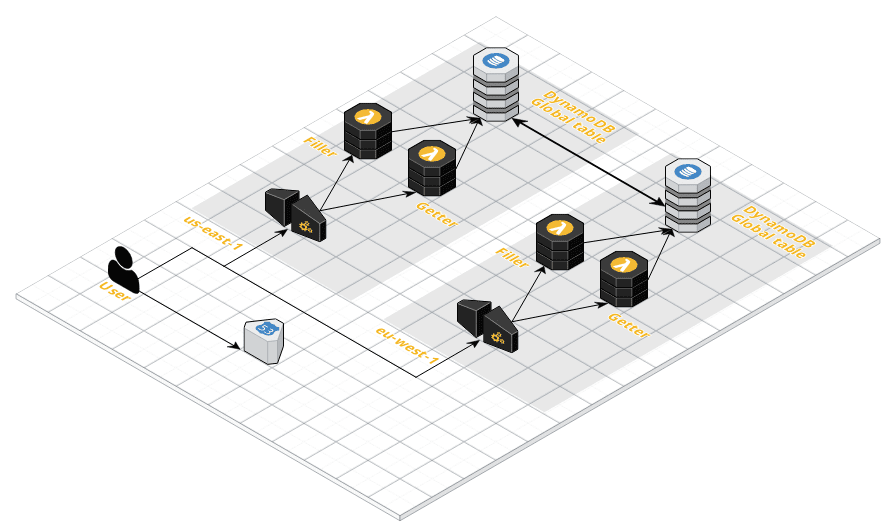

# AWS Global application playbground 

Template providing building blocks for global application testing (as demo 
purpose).

## Purpose of that repository 

This repository will contains templates for experimenting global deployment on AWS. 
Including:

- VPC Global/multi-region peering
- Aurora MySQL Global instances
- DynamoDB Global tables
- S3 Buckets with replication

## Lab1 - DynamoDB Global tables 

This first lab is focused on DynamoDB global tables. Here is the global 
architecture of that Lab: 

Building blocks used:

- Route53 (weighted policy)
- API Gateway
- Lambda functions
- DynamoDB global tables

## License 

This project is under MIT license.
