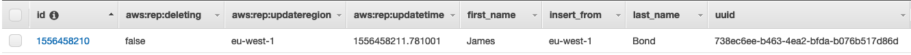

# Lab1 - DynamoDB global tables (accessed through API GateWay & Lambda)

Playing with DynamoDB global tables, API Gateway and Lambda functions.

## Prerequisites

Before launching this tempate you must have a registered DNS domain into Route53
(because a new RR will be created into it).

## Architecture


In this architecture:

- Route53 is used with a weighted policy (for load balancing user's requests)
- API Gateway on each region handle the user's requests
- Methods (POST a GET) of the REST API are handled by Lambda functions
- Lambda functions send & receive data to/from a DynamoDB table

For the purpose of that demo, we'll insert just users (defined by first and 
last name) into a Dynamodb global table. Route53 will load balances the requests 
meaning inserting should occurs from differents regions. By using CURL commands, 
we'll insert and request the API and show from where users has been inserted and 
from where data has been read. 

## Deployment

```bash
$ terraform init
$ terraform plan
$ terraform apply
```

## Example

First, we check to no new inserts has been done since last 10 seconds:

```bash
$ curl https://api.<YOUR-DOMAIN>/testing/users
{"statusCode": 404, "read_from": "eu-west-1", "body": [], "reason": "No items insert on last 10 seconds"}
````

Adding a new user:

```bash
$ curl -X POST --data '{"first_name":"James", "last_name":"Bond"}' https://api.<YOUR-DOMAIN>/testing/users
{"statusCode": 200, "insert_from": "eu-west-1", "text": "Successfully insert James Bond"}
```

The user James has been added from the eu-west-1 region. Here is state of DynamoDB after this insert:



Then, we get the last record (by default, the getter Lambda function will fetch 
only the last record inserted into last 10 seconds):

```bash
$ curl https://api.<YOUR-DOMAIN>/testing/users
{"statusCode": 200, "read_from": "us-east-1", "body": [{"aws:rep:deleting": false, "last_name": "Bond", "first_name": "James", "uuid": "738ec6ee-b463-4ea2-bfda-b076b517d86d", "insert_from": "eu-west-1", "aws:rep:updateregion": "eu-west-1", "aws:rep:updatetime": 1556458211.781001, "id": 1556458210.0}]}
````

Here, you can see that the data has been readed from the second region (and, 
obviously, data has been replicated in the meanwhile).
